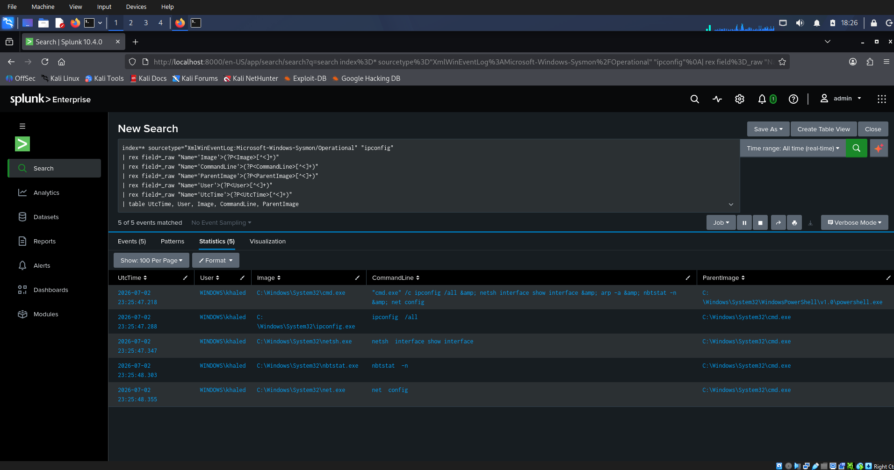
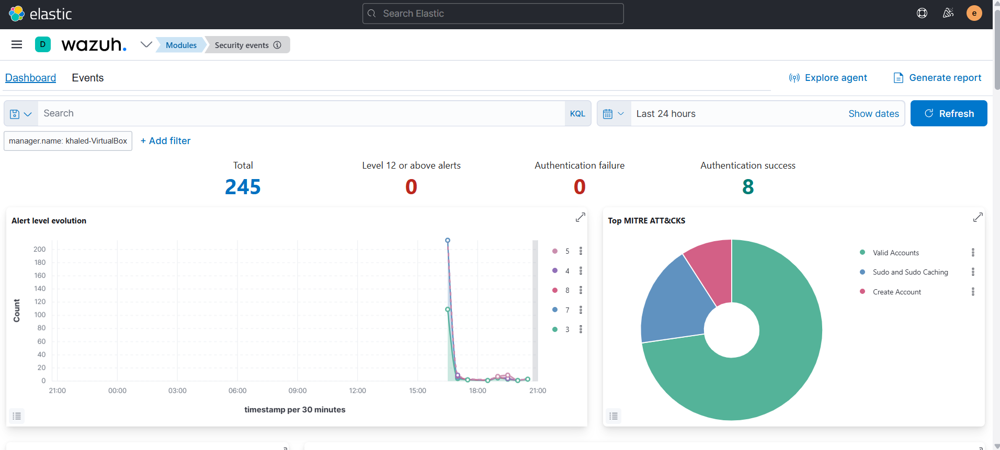
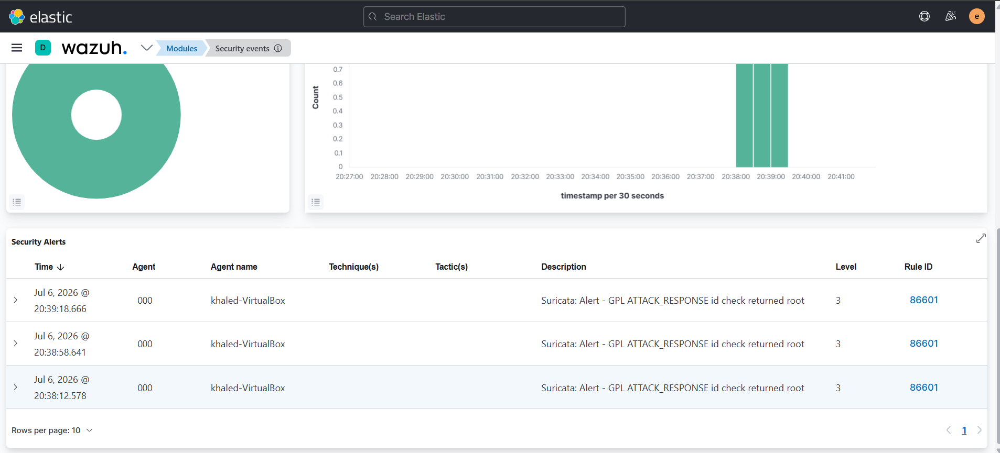

# 🛡️ SOC Home Lab Portfolio — Khaled Saifullah


> I have 8 years of hands-on IT and security experience and built this lab to bridge the gap between theory and the real skills SOC teams need. Every detection in this repo was built from a real attack simulation, not copied from documentation.

---

## 📋 Table of Contents

- [Lab 1 — Splunk + MITRE ATT&CK](#-lab-1--splunk-siem--mitre-attck-detection-lab)
- [Lab 2 — Wazuh SOC Lab](#-lab-2--wazuh-soc-lab)
- [Certifications](#-certifications)
- [Connect](#-connect)

---

## 🔵 Lab 1 — Splunk SIEM + MITRE ATT&CK Detection Lab

| Component | Tool |
|---|---|
| SIEM | Splunk |
| Endpoint Telemetry | Sysmon (XML config) |
| Attack Simulation | Atomic Red Team |
| Target Machine | Windows Server 2019 |
| Attacker Machine | Kali Linux |
| Virtualization | VirtualBox |

### Overview
A detection engineering lab where I simulated all 7 kill chain phases using Atomic Red Team against a live Windows Server 2019 target with Sysmon telemetry, then built SPL detection queries for each technique mapped to the MITRE ATT&CK framework.

The Splunk setup uses `sourcetype="XmlWinEventLog:Microsoft-Windows-Sysmon/Operational"` with `index=*`, `EventCode=1`, and a `rex`-based query extracting `Image`, `CommandLine`, `ParentImage`, `User`, and `UtcTime` fields.

### Key Achievements
- ✅ 30 MITRE ATT&CK techniques simulated and detected
- ✅ Custom SPL queries written for each detection
- ✅ Full kill chain coverage: Reconnaissance → Impact
- ✅ Techniques run using `Invoke-AtomicTest` with specific test numbers
- ✅ Verified detections using real Sysmon telemetry from a live Windows Server target

### Screenshot

**Splunk detecting T1016 — network discovery chain caught across 5 process creation events**


### MITRE ATT&CK Coverage

| Phase | Techniques Covered |
|---|---|
| Reconnaissance | T1595, T1592, T1589 |
| Initial Access | T1566, T1190 |
| Execution | T1059, T1204 |
| Persistence | T1547, T1053 |
| Privilege Escalation | T1548, T1134 |
| Defense Evasion | T1070, T1036 |
| Impact | T1486, T1489 |

📁 [View all 30 detection writeups →](./detections/)

---

## 🟢 Lab 2 — Wazuh SOC Lab

> Single-Host Comprehensive Monitoring Architecture (SIEM / NIDS / HIDS)

| Component | Version | Role |
|---|---|---|
| Wazuh Manager | 4.5.4 | HIDS — host intrusion detection & rule engine |
| Elasticsearch | 7.17.13 | Data store and search index |
| Kibana | 7.17.13 | Analyst dashboard |
| Filebeat | 7.17.13 | Log shipper |
| Suricata | 6.0.4 | NIDS — 51,851 ET Open signatures |
| Ubuntu | 22.04 LTS Desktop | Host OS |
| Virtualization | VirtualBox | 10GB RAM · 60GB disk |

### Overview
A single-host SOC deployment built entirely from scratch on Ubuntu 22.04 running in VirtualBox. Full TLS-encrypted pipeline from network-level detection through to the Kibana analyst dashboard — verified end-to-end with live attack simulation.

### Data Flow
```
Network traffic ──► Suricata (eve.json) ──┐
                                          ├──► Wazuh Manager ──► Filebeat ──► Elasticsearch ──► Kibana
Host logs ────────────────────────────────┘
```

### Network Layout

| Machine | IP | Role |
|---|---|---|
| Ubuntu SOC Box | 192.168.56.103 | Wazuh + Elastic + Suricata |
| Kali Linux | 192.168.56.101 | Attacker |
| Windows Server | 192.168.56.102 | Target endpoint |

### Key Achievements
- ✅ Deployed complete SIEM/NIDS/HIDS pipeline from zero
- ✅ TLS certificates generated manually using elasticsearch-certutil
- ✅ Elasticsearch JVM heap capped at 2GB for 8GB RAM environment
- ✅ 51,851 Suricata ET Open signatures loaded and active
- ✅ Suricata wired into Wazuh via `localfile` block in ossec.conf
- ✅ Live detection verified — GPL ATTACK_RESPONSE rule 86601 fired and appeared in Kibana within seconds
- ✅ All package versions frozen with `apt-mark hold` to prevent breaking changes
- ✅ Troubleshot real issues — Wazuh 4.14.6 → 4.5.4 downgrade, ossec.conf cleanup, rbac.db reset, Suricata rules path fix

### Screenshots

**Security Events Dashboard — 245 alerts collected**


**Live Suricata Alert Detail in Kibana**


**Security Alerts Table — GPL ATTACK_RESPONSE detected**


📁 [View full Wazuh lab →](./wazuh-lab/)

---

## 🎓 Certifications

| Certification | Issuer | Status |
|---|---|---|
| Security+ | CompTIA | ✅ Completed |
| CySA+ | CompTIA | 🔄 In Progress |

---

## 🤝 Connect

[](https://www.linkedin.com/in/khaledbs)

---

> ⚠️ All activities performed in an isolated lab environment. No production systems or unauthorized networks involved.
